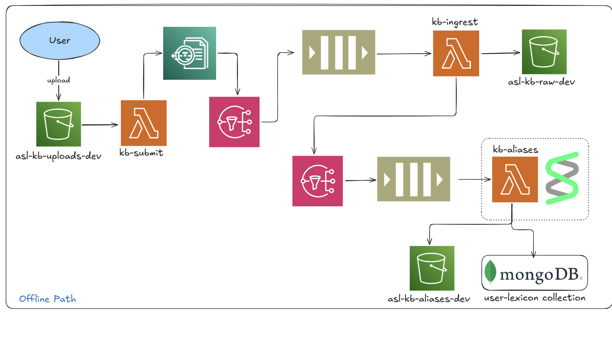
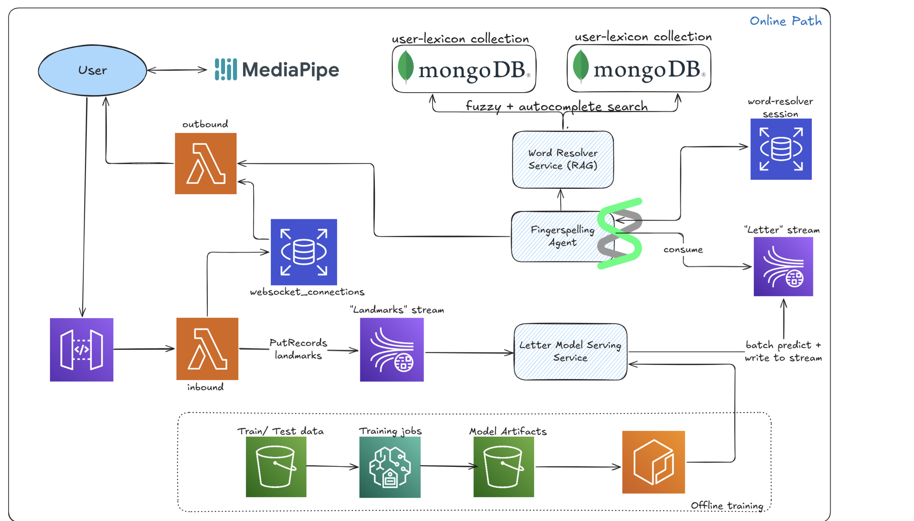

# Hand2Word

A real-time ASL (American Sign Language) fingerspelling recognition pipeline on AWS, paired with a MongoDB Atlas Search–powered lexicon for correction and disambiguation.




## Overview

Hand2Word supports two paths:

- **Online decoding** — low-latency letter aggregation → word resolution
- **Offline ingestion** — document uploads → Textract OCR → Strand Agent–driven alias generation

Both paths converge on Atlas fuzzy search (and optional autocomplete) over surface forms and aliases to map noisy fingerspelled sequences (e.g., `AW6` → `AWS`).

---

## Online Path — Real-Time Recognition

```
Client → API Gateway (WebSocket) → Lambda → Kinesis → Word Resolver → MongoDB Atlas → Outbound Lambda → Client
```

1. **Client** streams hand landmark frames from the camera to API Gateway via WebSocket.
2. **Inbound Lambda** authenticates sessions and publishes landmarks to a Kinesis stream (`asl-landmarks-stream`).
3. **Word Resolver Service** consumes letter predictions, aggregates them per session, and applies stability logic (~200 ms sliding window).
   - Uses **Redis** for session state (windows + committed letters).
   - Once a stable letter sequence forms, queries **MongoDB Atlas Search** to correct or expand partial words (e.g., `AW6T` → `AWS`).
4. **Outbound Lambda** pushes finalized word results back to the client over the same WebSocket connection, with per-session acknowledgements and latency tracking.

---

## Offline Path — Knowledge Base Construction

```
S3 Upload → Textract → SNS → SQS → Ingest Lambda → Alias Builder (Strand Agent) → MongoDB Atlas
```

1. **User uploads a document** (PDF) to the `kb_uploads` S3 bucket.
2. **Submit Lambda** starts an Amazon Textract job and records metadata in DynamoDB (`kb_jobs`).
3. **SNS → SQS → Ingest Lambda** — when Textract finishes, it posts to SNS → SQS. The ingest Lambda retrieves text, removes stopwords/URLs, deduplicates tokens, and writes clean words to `kb_raw`.
4. **Alias Builder Lambda (Strand Agent)** processes cleaned tokens in batches of 100–200:
   - Invokes an LLM-backed Strand Agent with domain-specific confusion rules (e.g., `W ↔ 6`, `O ↔ 0`, `N ↔ M`).
   - Generates realistic spelling-level alias variants, e.g.:
     ```json
     { "surface": "AWS", "aliases": ["AW6", "A-W-S", "A W S"] }
     ```
   - Confidence-weighted filtering retains only high-quality aliases (score ≥ 0.5).
   - Aliases are written to `kb_aliases` (S3) and bulk-upserted into **MongoDB Atlas**.

---

## Tech Stack

| Layer | Technology |
|---|---|
| Streaming | AWS Kinesis |
| Serverless | AWS Lambda |
| Real-time API | API Gateway (WebSocket) |
| OCR | Amazon Textract |
| Messaging | AWS SNS + SQS |
| Session State | Redis |
| Storage | S3, DynamoDB |
| Search / RAG | MongoDB Atlas Search |
| Alias Generation | Strand Agent (LLM-backed) |
